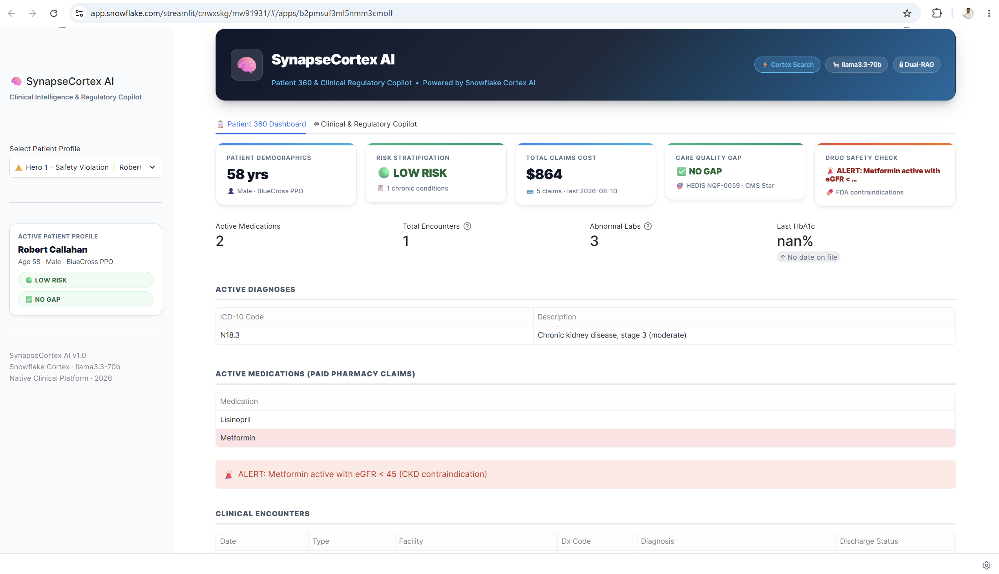
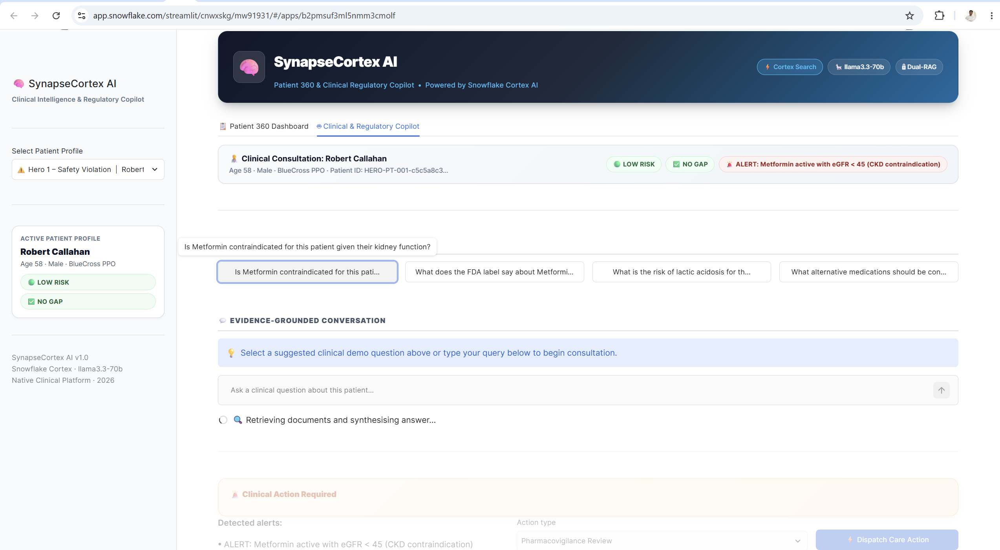
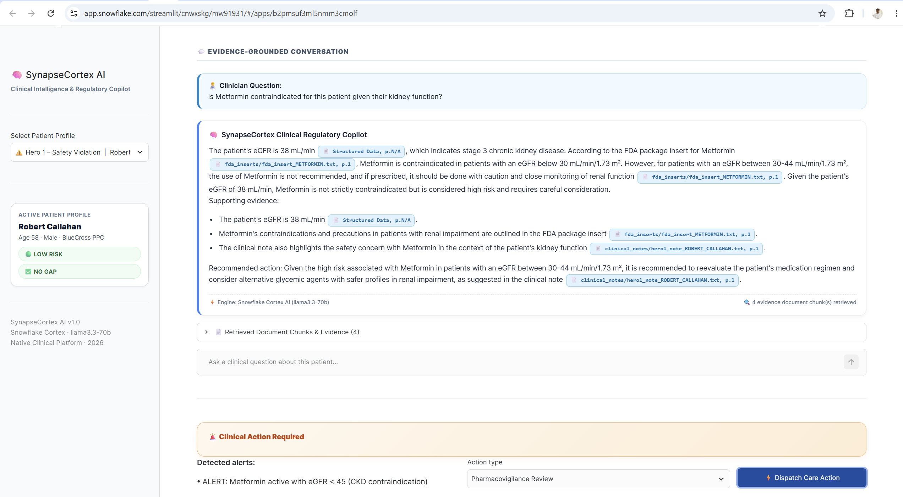
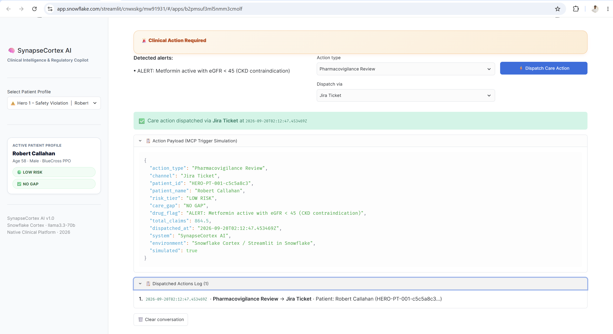
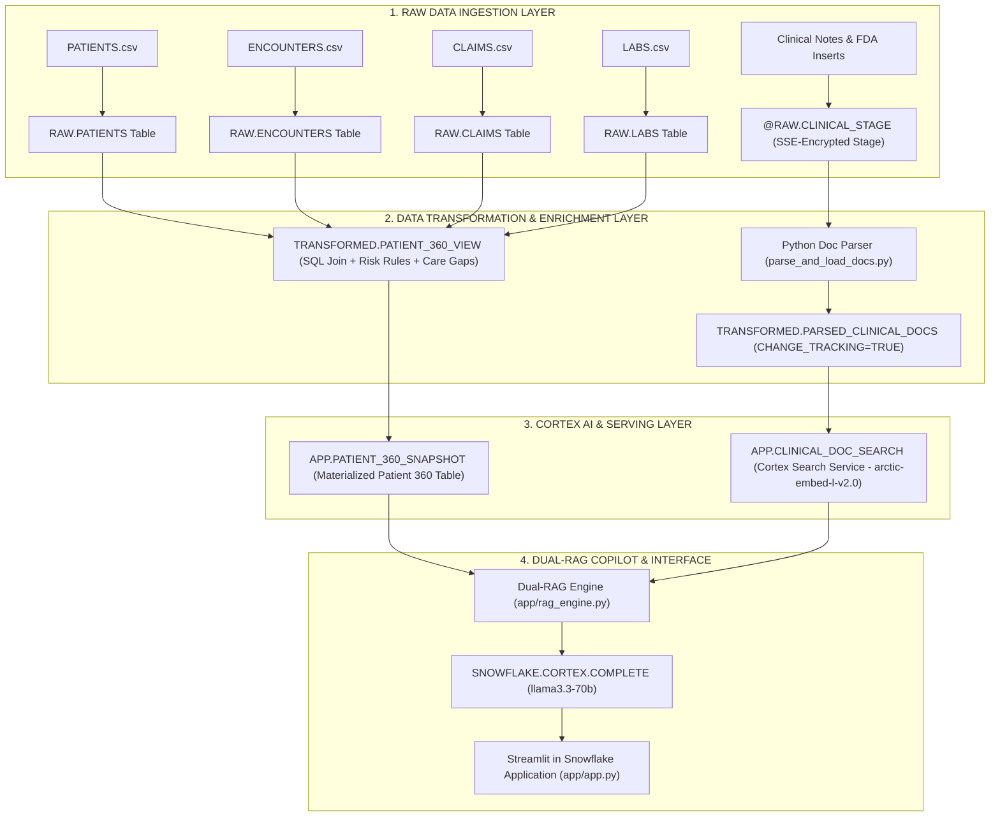
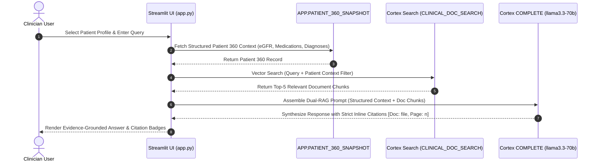

# SynapseCortex AI: Patient & Member 360 & Clinical Regulatory Copilot

A Snowflake-native clinical intelligence platform unifying structured EHR data, unstructured clinical documentation, and generative AI under strict citation enforcement.

[](https://www.snowflake.com/en/data-cloud/cortex/)
[](https://www.python.org/)
[](https://docs.snowflake.com/en/developer-guide/streamlit/about-streamlit)
[](https://docs.snowflake.com/en/user-guide/snowflake-cortex/llm-functions)
[](https://docs.snowflake.com/en/user-guide/snowflake-cortex/cortex-search)
[](LICENSE)

**Live Application URL**: [Open in Snowsight](https://app.snowflake.com/streamlit/cnwxskg/mw91931/#/apps/b2pmsuf3ml5nmm3cmolf)

---

## Table of Contents

- [Executive Summary](#executive-summary)
- [Application Screenshots](#application-screenshots)
- [Key Features & Business Impact](#key-features--business-impact)
- [Data Processing Pipeline & Architecture](#data-processing-pipeline--architecture)
  - [Pipeline Flow Diagram](#pipeline-flow-diagram)
  - [Dual-RAG Execution Workflow](#dual-rag-execution-workflow)
- [Documentation Index](#documentation-index)
- [Hero Clinical Scenarios](#hero-clinical-scenarios)
  - [Scenario 1: Medication Safety Contraindication](#scenario-1-medication-safety-contraindication)
  - [Scenario 2: Preventive Care Quality Gap](#scenario-2-preventive-care-quality-gap)
  - [Scenario 3: Polypharmacy & High-Risk Management](#scenario-3-polypharmacy--high-risk-management)
- [Snowflake Object Inventory](#snowflake-object-inventory)
- [Staged Reference Documents](#staged-reference-documents)
- [Quick Setup & Installation](#quick-setup--installation)
- [Security, Compliance & Governance](#security-compliance--governance)
- [License](#license)

---

## Executive Summary

Healthcare platforms face a structural data challenge: over 80% of critical patient information resides in unstructured clinical encounter notes and complex regulatory filings, while structured patient metrics remain isolated in relational database tables.

**SynapseCortex AI** unifies structured Electronic Health Record (EHR) data with unstructured clinical narratives and FDA package inserts natively within Snowflake. Operating entirely inside the customer's Snowflake governance perimeter, it delivers real-world decision support across three core clinical domains:

| Clinical Challenge | Technical Solution | Business & Regulatory Impact |
| :--- | :--- | :--- |
| **Medication Safety** | Correlates FDA contraindications with real-time eGFR and Creatinine lab values using deterministic SQL logic. | Reduces adverse drug events (ADEs), prevents hospital readmissions, and minimizes clinical liability. |
| **Care Quality Gaps** | Evaluates multi-year lab histories against HEDIS NQF-0059 and CMS Star Rating criteria to flag overdue screenings. | Protects Medicare Advantage Star Ratings and safeguards value-based care reimbursement. |
| **Risk Stratification** | Stratifies population risk based on longitudinal claims expenditure, age, and chronic condition burden. | Directs intensive care management resources to top-decile high-risk, high-cost members. |

---

## Application Screenshots

### Tab 1 — Patient 360 Dashboard Metrics & Profile


### Tab 1 — Diagnoses, Active Medications & Lab History


### Tab 2 — Evidence-Grounded Clinical Regulatory Copilot


### Tab 2 — Clinical Action Dispatcher & Workflow Panel


---

## Key Features & Business Impact

- **Unified Patient 360 View**: Multi-way SQL join combining demographic profiles, clinical encounter histories, procedure billing claims, and LOINC laboratory observations.
- **Cortex Search Integration**: Vector search service (`CLINICAL_DOC_SEARCH`) leveraging `snowflake-arctic-embed-l-v2.0` embeddings over clinical encounter notes and FDA filings.
- **Dual-RAG Clinical Copilot**: Generative assistant driven by `llama3.3-70b` under strict system prompt guardrails that enforce inline document citations (`[Doc: <file_name>, Page: <page_number>]`).
- **Care Action Dispatcher**: Interactive workflow panel simulating Model Context Protocol (MCP) integrations for ticketing and alert systems (Jira, Slack, Email, PagerDuty).
- **Zero Data Movement**: All database operations, vector indexing, LLM inferences, and web UI rendering execute natively inside Snowflake without external data export.

---

## Data Processing Pipeline & Architecture

### Pipeline Flow Diagram

The following diagram details the multi-stage ETL and AI inference pipeline operating inside Snowflake:



### Dual-RAG Execution Workflow



---

## Documentation Index

Detailed technical documentation is available in the [`docs/`](docs/) directory:

- [System Architecture Specification](docs/ARCHITECTURE.md): Architectural tiers, data pipeline design, sequence diagrams, and security topology.
- [Clinical RAG Engine Specification](docs/CLINICAL_RAG_ENGINE.md): Data structures, Cortex Search configuration, LLM prompt engineering, and citation enforcement rules.
- [Database Schema Reference](docs/DATABASE_SCHEMA.md): Complete data dictionary for `RAW`, `TRANSFORMED`, and `APP` schemas.
- [Deployment & Setup Guide](docs/DEPLOYMENT_GUIDE.md): Environment configuration, SQL DDL execution sequence, and Streamlit in Snowflake (SiS) deployment steps.

---

## Hero Clinical Scenarios

The cohort dataset includes three validated test profiles representing key clinical scenarios:

### Scenario 1: Medication Safety Contraindication
- **Patient**: Robert Callahan (`HERO-PT-001`) | Age 58
- **Clinical Profile**: Chronic Kidney Disease (CKD) Stage 3 (eGFR 38 mL/min, Creatinine 2.4 mg/dL) with an active Metformin 1000mg BID prescription.
- **System Finding**: Triggers an `ALERT: Metformin active with eGFR < 45` flag. The copilot retrieves FDA Black Box Warning guidelines from `fda_insert_METFORMIN.txt` citing contraindication risks for lactic acidosis.

### Scenario 2: Preventive Care Quality Gap
- **Patient**: Linda Moreno (`HERO-PT-002`) | Age 62
- **Clinical Profile**: Type 2 Diabetes Mellitus with last recorded HbA1c test result of 7.8% on 2025-07-11 (14 months overdue).
- **System Finding**: Flags an unclosed care gap under HEDIS NQF-0059 and ADA 2026 guidelines. The copilot highlights Star Rating degradation risks and recommended outreach steps.

### Scenario 3: Polypharmacy & High-Risk Management
- **Patient**: James Whitfield (`HERO-PT-003`) | Age 71
- **Clinical Profile**: 8 chronic conditions, 9 active medications, $51,755 YTD claims expenditure, and 3 acute encounter admissions.
- **System Finding**: Categorized as `HIGH RISK`. The copilot identifies multi-drug interaction vectors (Carvedilol + Albuterol) backed by `fda_insert_POLYPHARMACY_HIGH_RISK.txt` citations.

---

## Snowflake Object Inventory

| Schema | Object Name | Type | Description |
| :--- | :--- | :--- | :--- |
| `RAW` | `PATIENTS` | Table | 50 patient demographic records |
| `RAW` | `ENCOUNTERS` | Table | 102 clinical visit encounter logs |
| `RAW` | `CLAIMS` | Table | 215 medical and pharmacy claim records |
| `RAW` | `LABS` | Table | 150 LOINC-coded lab results |
| `RAW` | `@CLINICAL_STAGE` | Internal Stage | SSE-encrypted stage containing text documents |
| `TRANSFORMED` | `PARSED_CLINICAL_DOCS` | Table | Extracted text chunks with `CHANGE_TRACKING = TRUE` |
| `TRANSFORMED` | `PATIENT_360_VIEW` | View | 4-way join view with embedded risk and gap calculation logic |
| `APP` | `CLINICAL_DOC_SEARCH` | Search Service | Cortex Search Service using `snowflake-arctic-embed-l-v2.0` |
| `APP` | `PATIENT_360_SNAPSHOT` | Table | Materialized 50-row Patient 360 table for application reads |

---

## Staged Reference Documents

| Document File | Category | Associated Context | Content Summary |
| :--- | :--- | :--- | :--- |
| `hero1_note_ROBERT_CALLAHAN.txt` | Clinical Note | Hero 1 | Consult note documenting CKD Stage 3 and Metformin usage |
| `hero2_note_LINDA_MORENO.txt` | Clinical Note | Hero 2 | Outpatient visit note noting overdue HbA1c screening |
| `hero3_note_JAMES_WHITFIELD_inpatient.txt` | Clinical Note | Hero 3 | Discharge summary for inpatient NSTEMI admission |
| `hero3_note_JAMES_WHITFIELD_outpatient.txt` | Clinical Note | Hero 3 | Follow-up encounter note detailing COPD and polypharmacy |
| `hero3_note_JAMES_WHITFIELD_ED.txt` | Clinical Note | Hero 3 | Emergency department encounter note for hypertensive crisis |
| `fda_insert_METFORMIN.txt` | FDA Package Insert | FDA Reference | Black Box Warning and eGFR dosing contraindications |
| `fda_insert_HBA1C_MONITORING_STANDARD.txt` | Clinical Standard | Clinical Reference | HEDIS NQF-0059 and ADA 2026 diabetes testing guidelines |
| `fda_insert_POLYPHARMACY_HIGH_RISK.txt` | Clinical Standard | Clinical Reference | Beers Criteria and drug-drug interaction risk matrix |

---

## Quick Setup & Installation

```bash
# Clone repository
git clone https://github.com/nishnarudkar/SynapseCortex-AI-Patient-Member-360-Clinical-Regulatory-Copilot.git
cd SynapseCortex-AI-Patient-Member-360-Clinical-Regulatory-Copilot

# Create and activate virtual environment
python -m venv venv
source venv/bin/activate  # On Windows: .\venv\Scripts\Activate.ps1

# Copy environment template & configure Snowflake credentials
cp .env.example .env

# Install requirements
pip install -r requirements.txt

# Execute data ingestion pipeline
python upload_to_snowflake.py
python parse_and_load_docs.py

# Launch Streamlit app locally
streamlit run app/app.py
```

For complete Streamlit in Snowflake (SiS) deployment instructions, refer to the [Deployment Guide](docs/DEPLOYMENT_GUIDE.md).

---

## Security, Compliance & Governance

- **Zero Data Egress**: All vector search indexing, embedding generation, and LLM inferences occur strictly within the Snowflake data perimeter.
- **Server-Side Encryption**: Staged files are encrypted at rest using `SNOWFLAKE_SSE`.
- **Hallucination Prevention**: Prompt logic enforces that claims unsupported by context return `Insufficient evidence.`
- **Audit Traceability**: Care action dispatch triggers generate immutable ISO-8601 logs for compliance auditing.

---

## License

Distributed under the MIT License. See `LICENSE` for details.
