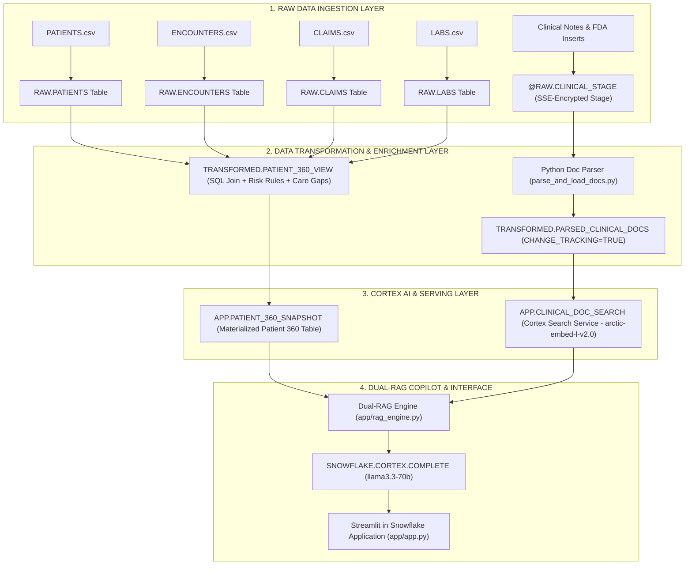
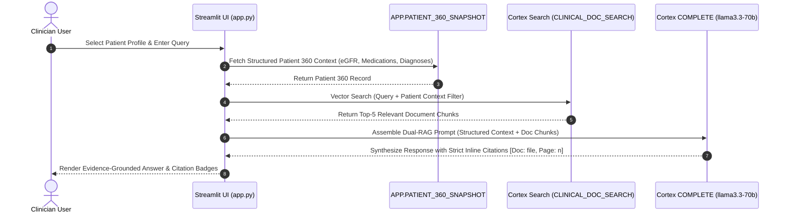

# SynapseCortex AI — Architecture Specification

## Overview

SynapseCortex AI is an enterprise-grade clinical decision support and patient intelligence platform built natively on the Snowflake Data Cloud. The architecture integrates structured Electronic Health Record (EHR) data with unstructured clinical encounter notes and FDA regulatory filings within a unified data warehouse and generative AI processing layer.

By executing all processing — structured queries, vector indexing, embedding generation, LLM synthesis, and application rendering — inside Snowflake's security perimeter, SynapseCortex AI maintains zero data egress and enterprise HIPAA readiness.

---

## High-Level System Architecture

The application is structured into three primary architectural tiers: Data Ingestion & Storage Layer (RAW), Data Transformation & Intelligence Layer (TRANSFORMED), and Application & Serving Layer (APP).

```
+---------------------------------------------------------------------------------------+
|                               SYNAPSE_HEALTH Database                                 |
|                                                                                       |
|  +---------------------------------------------------------------------------------+  |
|  | RAW Schema                                                                      |  |
|  |  - PATIENTS (Structured EHR demographics & insurance)                           |  |
|  |  - ENCOUNTERS (Clinical visits, facilities, discharge statuses)                |  |
|  |  - CLAIMS (Medical & pharmacy billing claims history)                          |  |
|  |  - LABS (LOINC-coded lab observations & reference ranges)                      |  |
|  |  - @CLINICAL_STAGE (SSE-encrypted internal stage for text documents)          |  |
|  +---------------------------------------------------------------------------------+  |
|                                           |                                           |
|                                           v  Python Parsers & SQL Views               |
|  +---------------------------------------------------------------------------------+  |
|  | TRANSFORMED Schema                                                              |  |
|  |  - PARSED_CLINICAL_DOCS (Document chunks with metadata & change tracking)      |  |
|  |  - PATIENT_360_VIEW (Unified 4-way join + Risk Tier + Care Gap + Safety Flags)   |  |
|  +---------------------------------------------------------------------------------+  |
|                                           |                                           |
|                                           v  Cortex Search Service & Snapshot Table   |
|  +---------------------------------------------------------------------------------+  |
|  | APP Schema                                                                      |  |
|  |  - CLINICAL_DOC_SEARCH (Cortex Search Service using arctic-embed-l-v2.0)       |  |
|  |  - PATIENT_360_SNAPSHOT (Materialized 50-patient longitudinal profile table)     |  |
|  +---------------------------------------------------------------------------------+  |
|                                           |                                           |
|                                           v  Streamlit in Snowflake                   |
|  +---------------------------------------------------------------------------------+  |
|  | User Interface (app/app.py)                                                     |  |
|  |  - Tab 1: Patient 360 Dashboard                                                  |  |
|  |  - Tab 2: Clinical & Regulatory Copilot (Dual-RAG Chat & Action Dispatcher)      |  |
|  +---------------------------------------------------------------------------------+  |
+---------------------------------------------------------------------------------------+
```

### Data Processing Pipeline Flowchart



---

## Sequence & Data Flow



---

## Data Tier Breakdown

### 1. RAW Schema (Landing Layer)
The `RAW` schema acts as the landing zone for ingested structured EHR data and unstructured document files.
- `PATIENTS`: Contains patient identifiers, demographic details, birth dates, and insurance plan metadata.
- `ENCOUNTERS`: Tracks outpatient visits, inpatient stays, emergency admissions, primary diagnoses, and facility metadata.
- `CLAIMS`: Stores medical billing and pharmacy prescription claim transactions.
- `LABS`: Records laboratory observations, numerical results, reference ranges, and abnormal flag indicators (H, L, HH, LL, A).
- `@CLINICAL_STAGE`: Snowflake internal stage secured with server-side encryption (`SNOWFLAKE_SSE`), hosting raw encounter notes and FDA package inserts.

### 2. TRANSFORMED Schema (Enrichment Layer)
The `TRANSFORMED` schema applies clinical business logic, joins, and text tokenization.
- `PARSED_CLINICAL_DOCS`: Stores extracted document chunks with file names, page numbers, category tags, and full text content. `CHANGE_TRACKING = TRUE` is enabled to support Cortex incremental indexing.
- `PATIENT_360_VIEW`: A comprehensive SQL view joining `PATIENTS`, `ENCOUNTERS`, `CLAIMS`, and `LABS`. Computes:
  - **Risk Stratification Tier**: `HIGH RISK` vs `LOW RISK` based on claims cost, age, and chronic condition burden.
  - **Care Gap Status**: Evaluates HEDIS NQF-0059 diabetes screening compliance (e.g., overdue HbA1c testing).
  - **Drug Safety Flag**: Evaluates drug-lab contraindications (e.g., Metformin active when eGFR < 45 mL/min).

### 3. APP Schema (Serving & Search Layer)
The `APP` schema houses objects optimized for application serving and low-latency retrieval.
- `PATIENT_360_SNAPSHOT`: Materialized table built from `PATIENT_360_VIEW` for instant structured lookups by the Streamlit application and RAG engine.
- `CLINICAL_DOC_SEARCH`: Snowflake Cortex Search Service utilizing `snowflake-arctic-embed-l-v2.0` embeddings for hybrid semantic and keyword retrieval over `PARSED_CLINICAL_DOCS`.

---

## Dual-RAG Engine Design

The Dual-RAG (Retrieval-Augmented Generation) engine combines two distinct retrieval pipelines:

1. **Structured Retrieval (Context A)**: Queries `APP.PATIENT_360_SNAPSHOT` for exact SQL metrics, lab history, active medication lists, and diagnosis codes.
2. **Unstructured Retrieval (Context B)**: Queries `APP.CLINICAL_DOC_SEARCH` using Cortex Search SDK to retrieve top-$k$ relevant text chunks from clinical encounter notes and FDA package inserts.

Both contexts are injected into a strict system prompt executed by `SNOWFLAKE.CORTEX.COMPLETE` using Meta's `llama3.3-70b` model at low temperature ($T = 0.05$). Every factual assertion must be attributed using the inline format `[Doc: <file_name>, Page: <page_number>]`.

---

## Security & Governance Principles

- **Zero Data Egress**: All data processing, vector embeddings, and LLM inferences are executed natively within Snowflake. No data is transmitted to external third-party API providers.
- **Role-Based Access Control (RBAC)**: Access to database objects is strictly governed by Snowflake role hierarchies (`SNOWFLAKE.CORTEX_USER`).
- **Server-Side Encryption**: Staged documents are encrypted at rest via `SNOWFLAKE_SSE`.
- **Deterministic Hallucination Prevention**: Prompts enforce that if neither context contains evidence for a claim, the model must explicitly state `Insufficient evidence.`.
